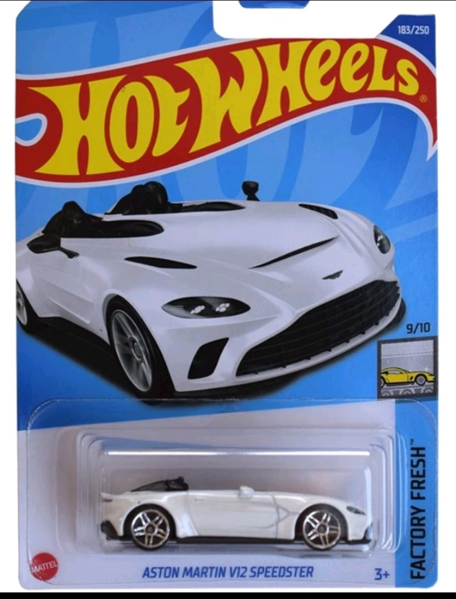

# OPTICAL CHARACTER RECOGNITION (OCR) PROJECT

## Target
Scan product packaging and record information on the packaging. For example:

The information we get:
- Name: ASTON MARTIN V12 SPEEDSTER
- Branch: FACTORY FRESH
- Serial number in package: 9/10
- Ordinal number in set: 183/250

## What's in this project?
- Using [Tesseract](https://github.com/tesseract-ocr/tesseract) (an open-source OCR engine) or deep learning models (such as `TrOCR`, `LayoutLM`, etc) to recognize and convert text from packaging image.

- Use retrained models (such as [RealESRGAN](https://github.com/xinntao/Real-ESRGAN)) for improving the resolution of the packaging or vision techniques (such as `grayscale`, `edge detection`) to improve OCR performance.
